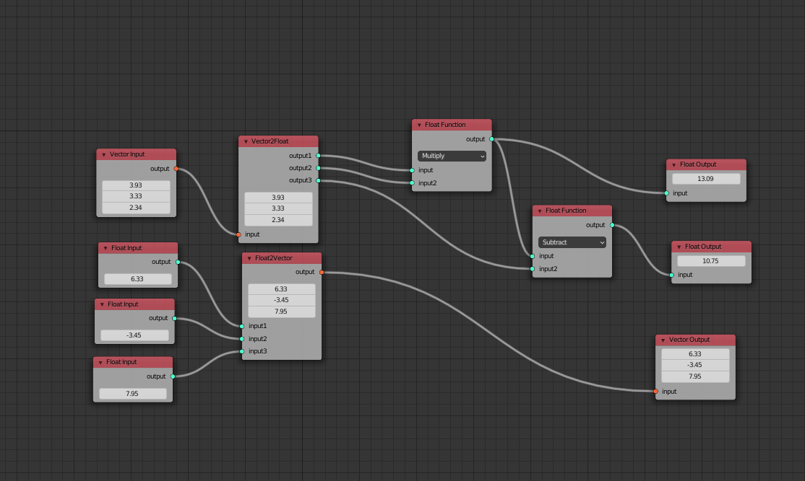

# NodeEditor
NodeEditor addon for blender  
Reference @atticus-lv  
Will re-write to build model-editor  

## Show

## Current

* 基本框架：自定义的tree-node-socket、tree中的node与socket采用字典查询、基于socket入度的拓扑排序

* 浮点数的输入输出与运算

* Vector的输入输出

## TODO

* 增加更多的节点
* 建模系统、颜色系统
* socket与节点内置值的联动
* socket的缺省
* 更好的UI和交互
* 节点的UI-update和process-Update
* 优化socket_values的参数传递 与 key
* 数据结果的自动刷新
* 将入度判断从prepare_num改为自定义函数查看link返回TrueFalse
* 封装string2list与list2string

## Large Change

* 原来socket父类内置有被继承的socket_value，但是由于子类数据类型的变化，父类种的socket_value已经删除，所有的子类必须自己定义socket_value才能满足transfer 传递socket_value的需求(已回退)
* 原来使用原生list类型用于存储bmesh的点边面数据，但是存在覆盖的问题无法解决，采用StringProperty代替

## Develop Need

fake-bpy-module  
Blender Development  

## Reference

Blender/3.0/scripts/templates_py  
https://gitlab.com/AquaticNightmare/rigging_nodes  
https://github.com/atticus-lv/simple_node_tree  
https://github.com/aachman98/Sorcar  
https://github.com/nortikin/sverchok  

## notice

建立object需要mesh，删除object时不会删除mesh,需要清理未使用数据clean  
